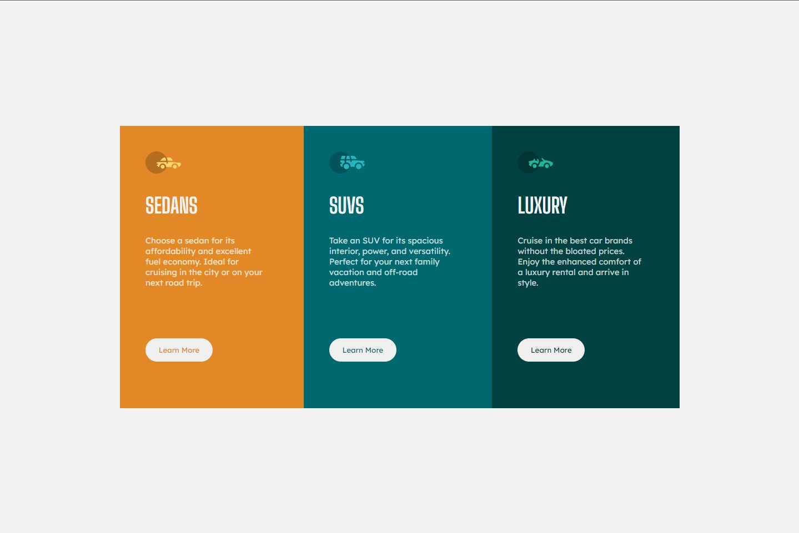

# Frontend Mentor - 3-column preview card component

## The challenge

The challenge is to build the nft image given and make it close as possible to original given one 

during my project I used flex box as layout method and learned and aquired many skills during 

building this project It was nice and fantastic project which help me inhance my ablity to build 

designs using css

As mentioned above, there are many ways to host your project for free. Our recommend hosts are:

I use netlify to host my project 

and submit my solution to frontend mentor

- [Netlify](https://www.netlify.com/)

It was fun building this project!** 🚀
